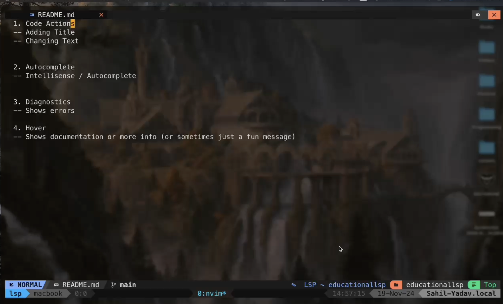

# educationallsp

## Table of Contents
- [Demo](#demo)
- [What is a Language Server](#what-is-a-language-server)
- [How does it work](#how-does-it-work)
- [JSON-RPC](#json-rpc)

# Demo
Click on the thumbnail to watch the video

## What is a Language Server?
A language server is a standalone program that provides language-specific features like *code completion*, *syntax checking*, *go-to definition*, and more to an editor or IDE via the Language Server Protocol (LSP). It acts as a backend, processing requests from the editor and returning results to enhance coding productivity and accuracy.

## How does it work?

### JSON-RPC
