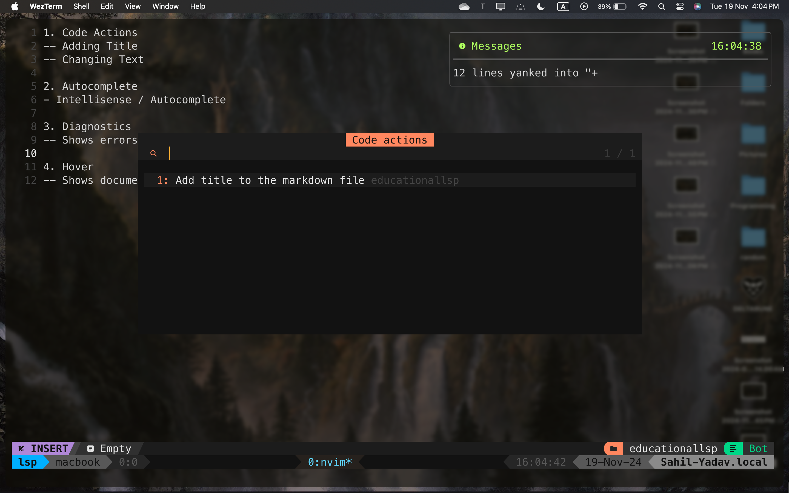
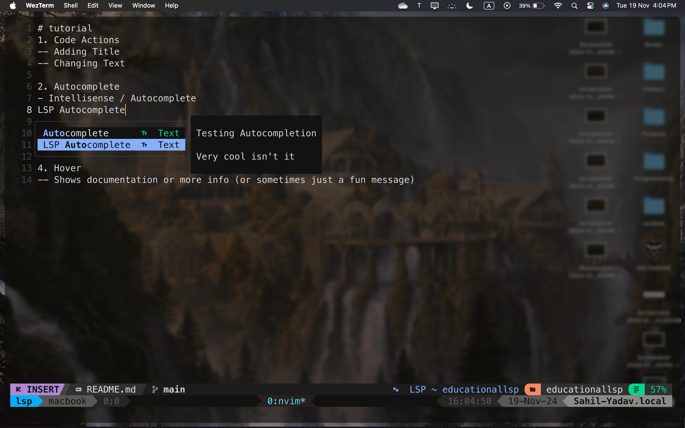
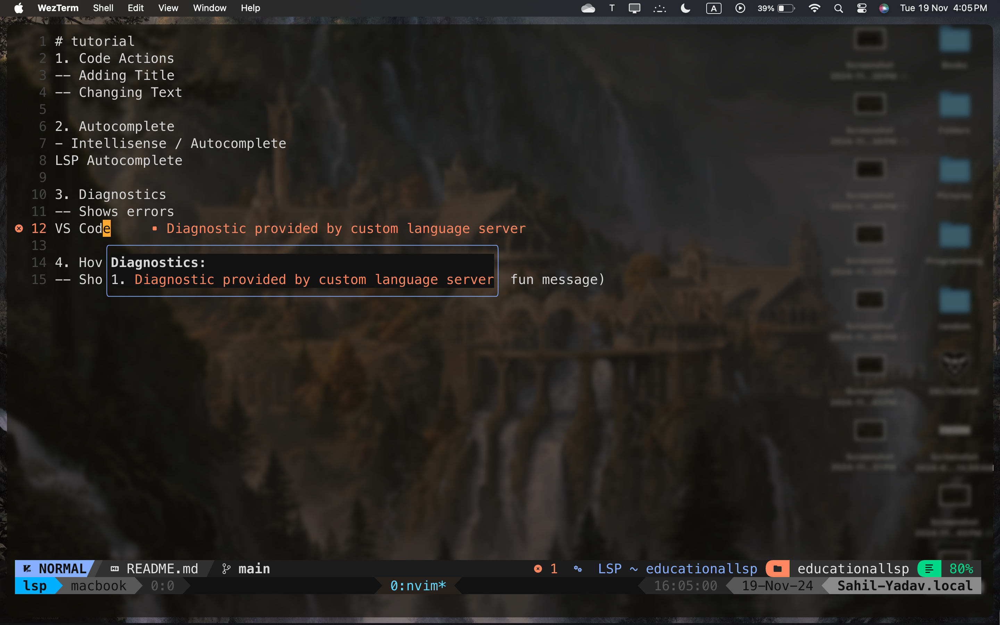
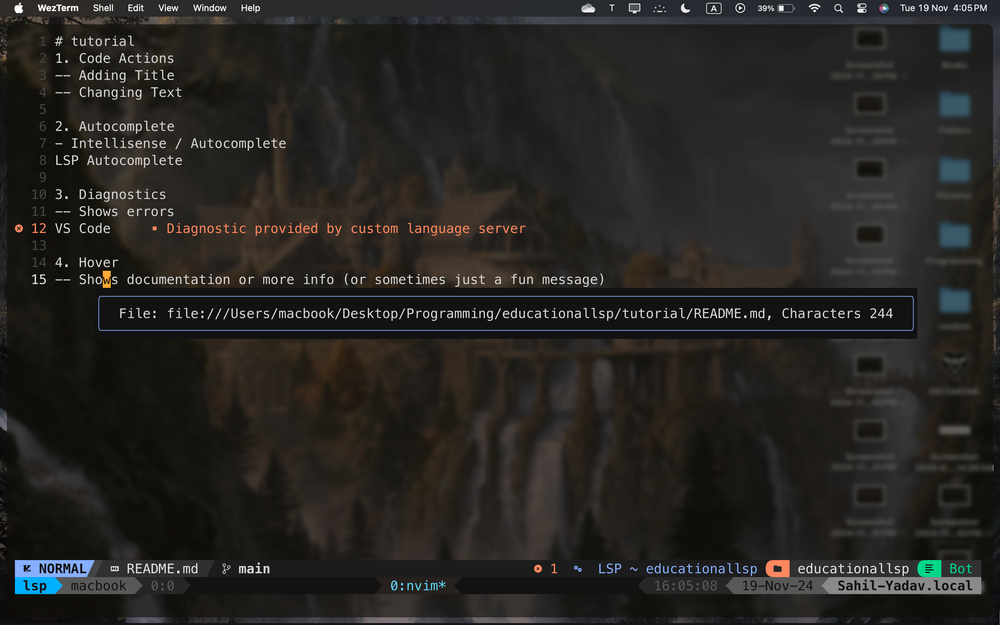

# educationallsp

## Table of Contents
- [Screenshots](#screenshots)
- [What is a Language Server](#what-is-a-language-server)
- [How does it work](#how-does-lsp-work)
- [JSON-RPC](#json-rpc)
- [Resources](#resources)

# Screenshots
</img>
</img>
</img>
</img>

## What is a Language Server?
A language server is a standalone program that provides language-specific features like *code completion*, *syntax checking*, *go-to definition*, and more to an editor or Integrated Development Environment (IDE) via the Language Server Protocol (LSP). It acts as a backend, processing requests from the editor and returning results to enhance coding productivity and accuracy.

### Key Features of a Language Server
- **Code Completion**: Suggests code completions based on context, reducing the need for memorizing syntax.
- **Syntax Checking**: Detects errors or warnings in the code as you type.
- **Go-To Definition**: Allows the editor to navigate directly to the definition of a variable, function, or class.
- **Hover Documentation**: Shows documentation or type information when hovering over a symbol in the code.
- **Refactoring**: Provides tools for renaming symbols, extracting methods, or restructuring code.

Language servers support multiple programming languages and can be integrated into any editor that supports LSP, such as Visual Studio Code, Sublime Text, or Vim.

## How does LSP work?
LSP defines a standard communication protocol between code editors and language servers. This standardization allows language servers to work across various development environments without needing custom configurations for each editor.

Language Servers and Clients(Code Editors) communicate with each other by sending JSON-RPC messages through stdout/stdin

### JSON-RPC
Here is an example of a JSON-RPC message sent by a code editor to a language server:

```json
{
  "jsonrpc": "2.0",
  "method": "textDocument/hover",
  "params": {
    "textDocument": {
      "uri": "file:///path/to/your/file.js"
    },
    "position": {
      "line": 10,
      "character": 5
    }
  },
  "id": 1
}
```
This is a JSON-RPC request sent from the client to the language server which invokes the hover method. This request also tells the server where the cursor was positioned when the method was invoked

## Resources
The resources I used for this project are listed below:
1. [Language Server Protocol Specification](https://microsoft.github.io/language-server-protocol/specifications/lsp/3.17/specification/)
Official specification of the Language Server Protocol (LSP) by Microsoft, outlining the complete protocol and its methods.

2. [Learn By Building: Language Server Protocol - TJ DeVries](https://www.youtube.com/watch?v=YsdlcQoHqPY&t=2s)
A YouTube video tutorial by TJ DeVries that walks you through building a language server using LSP, a great hands-on learning resource.

3. [JSON-RPC](https://www.jsonrpc.org/)
The official JSON-RPC website, where you can learn more about the protocol used to communicate between language servers and clients.

